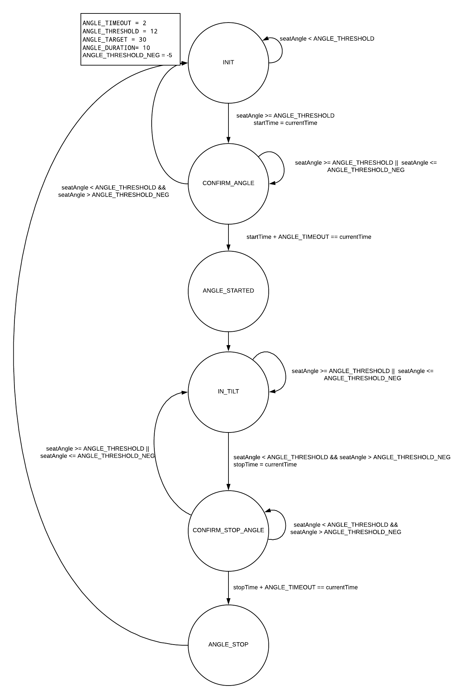
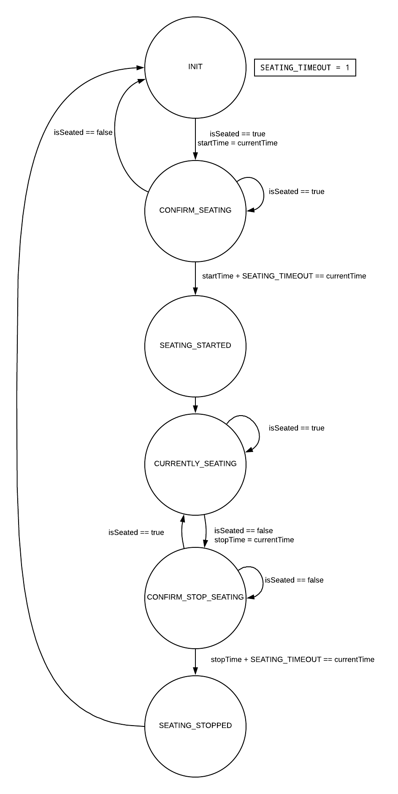
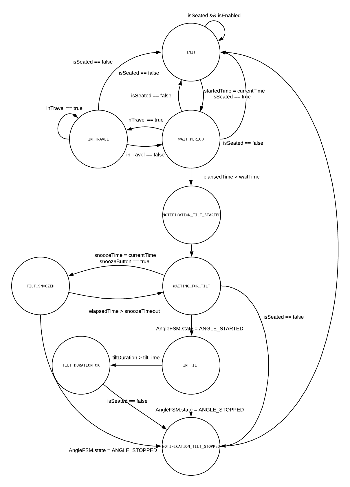

# MOvIT-Detect
MOvIT-Detect est la partie capteur du projet MOvIT+ et elle prend en charge différents capteurs I²C. Ces capteurs servent à déterminer l'état du fauteuil et de son passager. Le code d'acquisitions des capteurs est en C++ et il communique via MQTT au backend. Les capteurs supportés actuellement sont les suivants:

| Capteur | Utilité | Communication | Adresse |
| --- | --- | --- | --- |
| Accéléromètre MPU6050 | À l'aide de deux accéléromètres, il est possible de connaitre l'angle de la chaise selon le fauteuil en entier, et ainsi connaitre la position du patient | I²C | 0x68-0x69 |
| I/O Extender PCA9536 | Utilisé pour la télécommande, permet le contrôle de deux LED, une rouge et une verte, d'un moteur pour des vibrations et la lecture d'un bouton poussoir | I²C | 0x41 |
| ADC MAX11611 | ADC de 10-bit a 12 canaux, les 9 premiers sont utilisés pour la lecture de 9 capteurs à pression, sous le siège du patient, permet alors de connaitre le centre de gravité du patient, et la détection du patient sur le fauteuil | I²C | 0x35 |
| RTC MCP79410 | Permet de garder la date et l'heure du raspberry pi en temps réel, et ce même lorsqu'il est déconnecté, le RTC ce met a jour si besoin avec le serveur NTP | I²C | 0x35 & 0x6f |
| ToF Ranging VL53L0X | Permet de calculer la distance entre le sol et le fauteuil, utiliser avec le capteur de Flow PWM3901, cela permet de calculer la vitesse du fauteuil | I²C | 0x29 |
| Optical Flow SensorPMW3901 | Calcul la distance en deltaX et deltaY de son changement de position, permet de savoir si le fauteuil est en mouvement, et de quelle distance celui-ci c'est déplacé | SPI | X |

> Le guide _Configuration du système_ devrait avoir été suivit avant de procéder à cette installation.
___
## Table des matières :
- [MOvIT-Detect](#movit-detect)
  - [Table des matières :](#table-des-mati%c3%a8res)
- [1. Configuration des capteurs](#1-configuration-des-capteurs)
  - [1.1. Activation des capteurs](#11-activation-des-capteurs)
      - [Activation I²C](#activation-i%c2%b2c)
      - [Activation SPI](#activation-spi)
      - [Expend FileSystem (Optionel)](#expend-filesystem-optionel)
  - [1.2. Connection au RTC](#12-connection-au-rtc)
      - [Installation de i2cdetect](#installation-de-i2cdetect)
      - [RTC MCP79410](#rtc-mcp79410)
      - [Vérification de la date et heure](#v%c3%a9rification-de-la-date-et-heure)
- [2. Installation de MOvIt-Detect](#2-installation-de-movit-detect)
  - [2.1. Installation de GitHub](#21-installation-de-github)
  - [2.2. Installation de librairies](#22-installation-de-librairies)
  - [2.3. Installation de MOvIT-Detect](#23-installation-de-movit-detect)
      - [Exécution de MOvIT-Detect](#ex%c3%a9cution-de-movit-detect)
- [3. Explication du code](#3-explication-du-code)
  - [3.1. Machines à états finis](#31-machines-%c3%a0-%c3%a9tats-finis)
      - [Machine à états des bascules](#machine-%c3%a0-%c3%a9tats-des-bascules)
      - [Machine à états des déplacements](#machine-%c3%a0-%c3%a9tats-des-d%c3%a9placements)
      - [Machine à états de détection de présence](#machine-%c3%a0-%c3%a9tats-de-d%c3%a9tection-de-pr%c3%a9sence)
      - [Machine à états des notifications](#machine-%c3%a0-%c3%a9tats-des-notifications)
___

<br>
<br>

# 1. Configuration des capteurs
## 1.1. Activation des capteurs
Il faut, pour commencer, activer le port I²C et le port SPI du Raspberry Pi. Pour ce faire, il faut utiliser l'utilitaire `raspi-config`
```bash
sudo raspi-config
```
#### Activation I²C
Activation du I²C avec raspi-config
- Option 5
- Option P5
- Choisir Yes

#### Activation SPI
Activation du SPI avec raspi-config
- Option 5
- Option P4
- Choisir Yes

#### Expend FileSystem (Optionel)
Expending FileSystem avec raspi-config
- Option 7
- Option A1

Finalement choisir Finish et accepté de redémarré

## 1.2. Connection au RTC
#### Installation de i2cdetect
_i2cdetect_ permet de savoir quels appareils I²C sont connectés au système, de façon à être sûr que l'appareil est bien connecté et que son adresse est la bonne. Il faut installer cet outil comme suit:
```bash
sudo apt-get install -y i2c-tools
```
Une fois l'outil installé, on peut afficher la carte des appareils connectés avec la commande suivante:
```bash
i2cdetect -y 1
```
Avec le capteur RTC connecté uniquement, on obtient la sortie suivante:
```bash
     0  1  2  3  4  5  6  7  8  9  a  b  c  d  e  f
00:          -- -- -- -- -- -- -- -- -- -- -- -- -- 
10: -- -- -- -- -- -- -- -- -- -- -- -- -- -- -- -- 
20: -- -- -- -- -- -- -- -- -- -- -- -- -- -- -- -- 
30: -- -- -- -- -- -- -- -- -- -- -- -- -- -- -- -- 
40: -- -- -- -- -- -- -- -- -- -- -- -- -- -- -- -- 
50: -- -- -- -- -- -- -- 57 -- -- -- -- -- -- -- -- 
60: -- -- -- -- -- -- -- -- -- -- -- -- -- -- -- 6f 
70: -- -- -- -- -- -- -- --    
```
Il y a donc deux appareils I²C a l'adresse 0x57 un EEPROM et a 0x6F le RTC lui-même
#### RTC MCP79410
Le RTC (_Real-Time clock_) doit être activé dans Linux afin de pouvoir garder l'heure adéquatement. Il faut donc activer le "_device tree overlay_" du système Linux afin qu'il active le RTC au démarrage:
```bash
sudo echo "rtc-mcp7941x" | sudo tee --append /etc/modules
sudo echo "dtoverlay=i2c-rtc,mcp7941x" | sudo tee --append /boot/config.txt 
sudo reboot now
```
On peut confirmer que le RTC est bel et bien connecté a l'aide de `i2cdetect -y 1` si on obtient la sortie suivante:
```bash
     0  1  2  3  4  5  6  7  8  9  a  b  c  d  e  f
00:          -- -- -- -- -- -- -- -- -- -- -- -- -- 
10: -- -- -- -- -- -- -- -- -- -- -- -- -- -- -- -- 
20: -- -- -- -- -- -- -- -- -- -- -- -- -- -- -- -- 
30: -- -- -- -- -- -- -- -- -- -- -- -- -- -- -- -- 
40: -- -- -- -- -- -- -- -- -- -- -- -- -- -- -- -- 
50: -- -- -- -- -- -- -- 57 -- -- -- -- -- -- -- -- 
60: -- -- -- -- -- -- -- -- -- -- -- -- -- -- -- UU 
70: -- -- -- -- -- -- -- --    
```
Il faut également désactiver certains modules pour la fake-hwclock :

```bash
sudo apt-get -y remove fake-hwclock
sudo update-rc.d -f fake-hwclock remove
sudo systemctl disable fake-hwclock
```
Le RTC est utilisé par le système Linux, car 6f a été remplacé par UU, il faut ensuite modifier le fichier `/lib/udev/hwclock-set` et commenter certaines lignes:
```bash
sudo nano /lib/udev/hwclock-set
```
Les lignes à commenter sont les suivantes:
```bash
if [ -e /run/systemd/system ] ; then
    exit 0
fi
```
Il faut donc ajouter un "#" devant chacune des lignes de sorte à obtenir:
```bash
#if [ -e /run/systemd/system ] ; then
#    exit 0
#fi 
```

Il faut aussi commenter avec un "#" les lignes suivantes:
```bash
if [yes = "BADYEAR" ] ; then
    #/sbin/hwclock --rtc=$dev --systz --badyear
    ...
else
    #/sbin/hwclock --rtc=$dev --systz
    ...
fi
```

#### Vérification de la date et heure
On détermine la date et l'heure a l'aide de la commande `date` cette commande retourne la date et l'heure, voici la sortie de ce système:
```bash
Wed 16 Jan 14:43:42 EST 2019
```
Si la date est incorrecte, il faut changer de TimeZone, voici comment procédé, a l'aide de l'utilitaire `raspi-config` il faut:
- Choisir l'option 4
- Puis l'option I2
- Choisir ensuite le bon TimeZone selon votre location
- Choisir finish

Confirmer la date et l'heure avec `date`, si celle-ci est bonne, il faut l'écrire dans le RTC avec la commande suivante:
```bash
sudo hwclock -w
```

# 2. Installation de MOvIt-Detect
Notes:
Février 2021 : Tout le code fonctionne maintenant sur Python (v3.6+). Il n'es plus nécessaire de compiler quoi que ce soit. 

## 2.1. Installation de git et Python3
Si _git_ n'est pas installé, il faut exécuter cette commande : 
```bash
sudo apt-get install -y git python3 python3-venv`
```

## 2.2 Téléchargement du code source de MOvIT-Detect
Dans le répertoire MOvITPlus à la racine de l'utilisateur "pi" :
```bash
git clone https://github.com/introlab/MOvIT-Detect.git --recurse-submodules
```

## 2.2 Installation de l'environnement Python virtuel

Allez dans le répertoire MOvIT-Detect/python et faites:
```bash
# Création de l'environnement venv (une fois seulement)
python3 -m venv venv
# Activation de venv
source venv/bin/activate
# Installation des requis Python locaux
pip install -r requirements.txt
```

## 2.3 Démarrage du programme (acquisition et machines d'états)
Tous les modules peuvent être démarrés par un simple exécutable qui lance tout les sous modules:
```bash
# Aller dans le bon répertoire
cd ~/MOvITPlus/MOvIT-Detect/python
# Configure l'environnement virtuel
source source venv/bin/activate
# Lancer l'exécutable
python3 launcher.py
```

<br>
<br>

# 3. Explication du code
## 3.1. Machines à états finis
Le système embarqué est régi par différente machine à états finis _(fsm / finite state machines)_. Voici le détail de chacune d'entre elle :

#### Machine à états des bascules
La machine à état fini de détection de bascule permet de générer des événements de bascules lorsque le fauteuil quitte la zone de détection de -5° à 10°. Voici le schéma de cette machine a état fini.


#### Machine à états des déplacements
La machine à état fini de détection de déplacement détecte lorsque le fauteuil a subi un déplacement sur une certaine distance et généré un événement de déplacement. Voici le schéma de cette machine à état fini.


#### Machine à états de détection de présence
La machine a états finis de détection de présence, détecte lorsqu'une personne est assise sur le fauteuil. Elle permet d'éviter au possible les fausses détections. Voici le schéma de cette machine à état fini.


#### Machine à états des notifications
La machine à état fini des notifications permet de générer des notifications de bascule après un certain temps que la personne est assise sur le fauteuil, elle gère aussi les mises en veille de bascule. Voici le schéma de cette machine à états fini.

